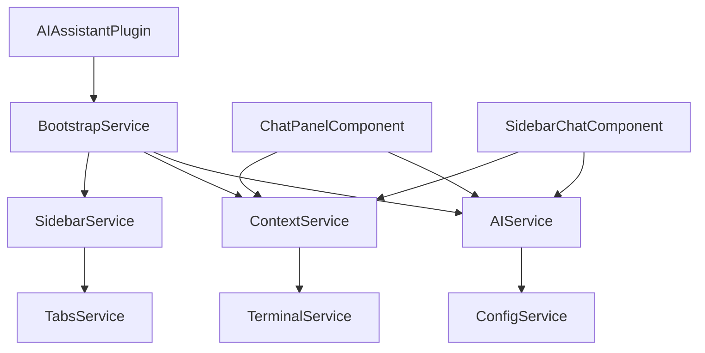

# 开发者指南

本指南面向希望参与 Tabby AI 助手插件开发或基于此插件进行二次开发的开发者。

## 🏗️ 开发环境设置

### 系统要求

- **Node.js** >= 14.0
- **npm** >= 6.0
- **TypeScript** >= 4.0
- **Angular CLI** >= 12.0

### 环境配置

1. **克隆项目**
   ```bash
   git clone https://github.com/your-username/tabby-ai-assistant.git
   cd tabby-ai-assistant
   ```

2. **安装依赖**
   ```bash
   npm install
   ```

3. **开发模式**
   ```bash
   # 开启监听模式，自动重新编译
   npm run watch
   
   # 或者手动编译
   npm run dev
   ```

4. **链接到 Tabby**
   ```bash
   # 创建软链接到 Tabby 插件目录
   # Windows (管理员权限)
   mklink /D "%APPDATA%\tabby\plugins\tabby-ai-assistant" "%CD%\dist"
   
   # macOS/Linux
   ln -s $(pwd)/dist ~/Library/Application\ Support/tabby/plugins/tabby-ai-assistant
   ```

## 📁 项目结构详解

```
tabby-ai-assistant/
├── 📁 src/                          # 源代码目录
│   ├── 📁 components/               # Angular 组件
│   │   ├── chat-panel.component.ts       # 主聊天面板组件
│   │   │   ├── 💬 聊天界面逻辑
│   │   │   ├── 🎨 UI 样式定义
│   │   │   └── 🔄 消息管理
│   │   ├── sidebar-chat.component.ts     # 侧边栏聊天组件
│   │   │   ├── 📱 紧凑型界面
│   │   │   └── 🚀 快速访问功能
│   │   ├── settings.component.ts         # 设置页面组件
│   │   │   ├── ⚙️ 配置界面
│   │   │   ├── 🧪 连接测试
│   │   │   └── 📝 参数验证
│   │   └── container.component.ts        # 容器组件
│   │       └── 📦 布局管理
│   ├── 📁 services/                 # 核心服务
│   │   ├── ai.service.ts                 # AI 服务核心
│   │   │   ├── 🤖 多AI提供商支持
│   │   │   ├── 💬 会话管理
│   │   │   ├── 🔄 请求处理
│   │   │   └── 🛡️ 错误处理
│   │   ├── context.service.ts            # 上下文管理
│   │   │   ├── 📝 文本选择监听
│   │   │   ├── 🎯 多终端支持
│   │   │   └── 🔄 模式切换
│   │   ├── sidebar.service.ts            # 侧边栏管理
│   │   │   ├── 📱 侧边栏控制
│   │   │   └── 🎛️ 状态管理
│   │   └── bootstrap.service.ts          # 插件启动
│   │       ├── 🚀 初始化逻辑
│   │       └── 🔧 服务注册
│   ├── 📁 providers/                # Angular 提供者
│   │   ├── config.provider.ts            # 配置提供者
│   │   ├── toolbar-button.provider.ts    # 工具栏按钮
│   │   └── settings-tab.provider.ts      # 设置页面标签
│   ├── 📁 icons/                    # 图标资源
│   │   └── robot.svg                     # AI 助手图标
│   └── index.ts                          # 插件入口点
├── 📁 docs/                         # 文档目录
│   ├── INSTALLATION.md                   # 安装指南
│   ├── API.md                            # API 文档
│   └── DEVELOPMENT.md                    # 本文档
├── 📁 dist/                         # 构建输出 (自动生成)
├── 📄 package.json                  # 项目配置
├── 📄 tsconfig.json                # TypeScript 配置
├── 📄 webpack.config.js            # 构建配置
└── 📄 README.md                    # 项目说明
```

## 🔧 核心架构解析

### 1. 插件生命周期

```typescript
// 插件启动流程
@NgModule({...})
export default class AIAssistantPlugin {
  constructor(private bootstrapService: AIAssistantBootstrapService) {
    // 1. 插件加载
    console.log('AI Assistant Plugin loaded')
    
    // 2. 初始化服务
    this.bootstrapService.initialize()
  }
}
```

### 2. 服务依赖关系



### 3. 数据流

```
用户输入 → 组件 → 服务 → AI API → 响应处理 → 界面更新
     ↓
   上下文收集 → 上下文服务 → 智能分析 → 查询增强
```

## 🚀 开发工作流

### 日常开发

1. **启动监听模式**
   ```bash
   npm run watch
   ```

2. **修改代码**
   - 保存文件后自动重新编译
   - Tabby 中插件自动重载（部分情况需要重启）

3. **调试**
   - 在 Tabby 中按 `F12` 打开开发者工具
   - 查看 Console 中的日志输出

### 调试技巧

#### 1. 日志输出

```typescript
// 使用统一的日志前缀
console.log('[AI助手]', '信息内容')
console.warn('[AI助手]', '警告内容')
console.error('[AI助手]', '错误内容')

// 条件日志
const DEBUG = true
if (DEBUG) {
  console.debug('[AI助手 调试]', '调试信息')
}
```

#### 2. 服务状态检查

```typescript
// 检查服务注入状态
constructor(private aiService: AIService) {
  console.log('[AI助手] AIService 注入状态:', !!this.aiService)
}

// 检查配置状态
ngOnInit() {
  console.log('[AI助手] 配置状态:', this.aiService.isConfigured())
  console.log('[AI助手] 当前配置:', this.config.store.aiAssistant)
}
```

#### 3. 错误跟踪

```typescript
// 全局错误处理
window.addEventListener('error', (event) => {
  console.error('[AI助手 全局错误]', event.error)
})

// Promise 错误处理
window.addEventListener('unhandledrejection', (event) => {
  console.error('[AI助手 未处理的Promise拒绝]', event.reason)
})
```

## 🔨 开发任务

### 添加新功能

1. **创建功能分支**
   ```bash
   git checkout -b feature/new-feature
   ```

2. **实现功能**
   - 添加服务方法
   - 创建组件界面
   - 编写单元测试

3. **测试验证**
   ```bash
   npm run build
   npm run test  # 如果有测试
   ```

4. **提交代码**
   ```bash
   git add .
   git commit -m "feat: add new feature"
   git push origin feature/new-feature
   ```

### 修复 Bug

1. **重现问题**
   - 确认问题存在
   - 记录复现步骤
   - 收集错误信息

2. **定位代码**
   - 使用开发者工具
   - 添加调试日志
   - 分析调用栈

3. **修复验证**
   - 实现修复代码
   - 验证修复效果
   - 确保无副作用

## 🧪 测试策略

### 手动测试清单

#### 基础功能测试

- [ ] 插件正确加载
- [ ] 工具栏按钮显示
- [ ] 设置页面可访问
- [ ] 配置保存生效

#### AI 服务测试

- [ ] OpenAI 连接测试
- [ ] Claude 连接测试  
- [ ] Ollama 本地连接测试
- [ ] 错误处理验证

#### 界面交互测试

- [ ] 聊天界面响应
- [ ] 消息发送接收
- [ ] 历史记录管理
- [ ] 上下文选择功能

### 自动化测试

```typescript
// 服务测试示例
describe('AIService', () => {
  let service: AIService
  let mockConfig: jasmine.SpyObj<ConfigService>

  beforeEach(() => {
    const spy = jasmine.createSpyObj('ConfigService', ['store'])
    
    TestBed.configureTestingModule({
      providers: [
        AIService,
        { provide: ConfigService, useValue: spy }
      ]
    })
    
    service = TestBed.inject(AIService)
    mockConfig = TestBed.inject(ConfigService) as jasmine.SpyObj<ConfigService>
  })

  it('should create', () => {
    expect(service).toBeTruthy()
  })

  it('should check configuration', () => {
    mockConfig.store = {
      aiAssistant: {
        provider: 'openai',
        apiKey: 'test-key',
        model: 'gpt-3.5-turbo'
      }
    }
    
    expect(service.isConfigured()).toBeTruthy()
  })
})
```

## 🎨 UI/UX 开发

### 主题系统

使用 Tabby 的 CSS 变量系统：

```scss
.ai-chat-panel {
  background: var(--theme-bg-color);
  color: var(--theme-text-color);
  border: 1px solid var(--theme-border-color);
}

// 主要颜色
.primary-button {
  background: var(--theme-color-primary);
  color: var(--theme-bg-color);
}

// 状态颜色
.error-message {
  color: var(--theme-color-danger);
}

.success-message {
  color: var(--theme-color-success);
}
```

### 响应式设计

```scss
// 移动端适配
@media (max-width: 768px) {
  .ai-chat-panel {
    padding: 8px;
    font-size: 14px;
  }
  
  .message {
    max-width: 95%;
  }
}

// 高分辨率屏幕
@media (min-resolution: 144dpi) {
  .ai-chat-panel {
    font-size: 15px;
  }
}
```

### 动画效果

```scss
// 消息动画
.message {
  opacity: 0;
  transform: translateY(20px);
  animation: slideIn 0.3s ease-out forwards;
}

@keyframes slideIn {
  to {
    opacity: 1;
    transform: translateY(0);
  }
}

// 加载动画
.loading-spinner {
  animation: spin 1s linear infinite;
}

@keyframes spin {
  to { transform: rotate(360deg); }
}
```

## 🔌 扩展开发

### 添加新的 AI 服务提供商

1. **定义配置接口**

```typescript
interface NewProviderConfig {
  apiKey: string
  model: string
  endpoint?: string
  customParam?: string
}
```

2. **扩展 AIService**

```typescript
// 在 buildRequest 方法中添加
case 'newProvider':
  return {
    model: config.model,
    messages: this.formatMessages(messages),
    customParam: config.customParam
  }

// 在 getApiUrl 方法中添加
case 'newProvider':
  return config.endpoint || 'https://api.newprovider.com/v1/chat'

// 在 getHeaders 方法中添加
case 'newProvider':
  headers['Authorization'] = `Bearer ${config.apiKey}`
  headers['Custom-Header'] = 'value'
  break

// 在 extractResponse 方法中添加
case 'newProvider':
  return data.result?.text || '无回复'
```

3. **更新设置界面**

在设置组件中添加新提供商的配置选项。

### 自定义组件开发

创建自定义聊天组件：

```typescript
@Component({
  selector: 'ai-custom-chat',
  template: `
    <div class="custom-chat-container">
      <div class="custom-header">
        <h4>自定义AI助手</h4>
      </div>
      <div class="custom-messages">
        <div *ngFor="let msg of messages" 
             [class.user]="msg.isUser" 
             [class.ai]="!msg.isUser">
          {{ msg.content }}
        </div>
      </div>
      <div class="custom-input">
        <input [(ngModel)]="inputMessage" 
               (keydown.enter)="sendMessage()"
               placeholder="输入消息...">
        <button (click)="sendMessage()">发送</button>
      </div>
    </div>
  `,
  styles: [`
    .custom-chat-container {
      height: 100%;
      display: flex;
      flex-direction: column;
    }
    /* 其他样式... */
  `]
})
export class CustomChatComponent implements OnInit {
  messages: Array<{content: string, isUser: boolean}> = []
  inputMessage = ''

  constructor(private aiService: AIService) {}

  ngOnInit() {
    // 初始化逻辑
  }

  async sendMessage() {
    if (!this.inputMessage.trim()) return

    // 添加用户消息
    this.messages.push({
      content: this.inputMessage,
      isUser: true
    })

    const userInput = this.inputMessage
    this.inputMessage = ''

    try {
      // 调用 AI 服务
      const response = await this.aiService.sendQuery(userInput)
      
      // 添加 AI 回复
      this.messages.push({
        content: response,
        isUser: false
      })
    } catch (error) {
      // 错误处理
      this.messages.push({
        content: '抱歉，出现了错误：' + error.message,
        isUser: false
      })
    }
  }
}
```

### 插件钩子开发

创建自定义的生命周期钩子：

```typescript
export interface AIAssistantPlugin {
  onMessageReceived?(message: ChatMessage): void
  onSessionCreated?(session: ChatSession): void
  onContextChanged?(context: ContextData): void
}

// 在服务中实现钩子调用
export class AIService {
  private plugins: AIAssistantPlugin[] = []

  registerPlugin(plugin: AIAssistantPlugin) {
    this.plugins.push(plugin)
  }

  private notifyPlugins<T extends keyof AIAssistantPlugin>(
    method: T, 
    ...args: Parameters<NonNullable<AIAssistantPlugin[T]>>
  ) {
    this.plugins.forEach(plugin => {
      const handler = plugin[method]
      if (typeof handler === 'function') {
        handler.apply(plugin, args)
      }
    })
  }

  async sendQuery(query: string): Promise<string> {
    // ... 发送逻辑
    
    // 通知插件
    this.notifyPlugins('onMessageReceived', message)
    
    return response
  }
}
```

## 📦 构建和发布

### 构建优化

```javascript
// webpack.config.js 优化配置
module.exports = {
  // ... 其他配置
  
  optimization: {
    minimize: true,
    sideEffects: false,
    usedExports: true
  },
  
  resolve: {
    alias: {
      '@': path.resolve(__dirname, 'src'),
      '@components': path.resolve(__dirname, 'src/components'),
      '@services': path.resolve(__dirname, 'src/services')
    }
  }
}
```

### 版本发布流程

1. **更新版本号**
   ```bash
   npm version patch  # 或 minor, major
   ```

2. **构建生产版本**
   ```bash
   npm run build
   ```

3. **创建发布包**
   ```bash
   tar -czf tabby-ai-assistant-v1.0.0.tar.gz dist/
   ```

4. **创建 GitHub Release**
   - 推送标签到 GitHub
   - 创建 Release 页面
   - 上传构建包

## 🐛 问题排查

### 常见问题

1. **插件未加载**
   ```
   检查点：
   - 文件路径是否正确
   - 权限是否充足  
   - index.ts 是否正确导出
   - 依赖是否安装完整
   ```

2. **服务注入失败**
   ```typescript
   // 检查服务是否在模块中正确声明
   @NgModule({
     providers: [
       AIService,  // 确保服务被提供
       ContextService
     ]
   })
   ```

3. **配置不生效**
   ```typescript
   // 检查配置提供者是否正确注册
   { provide: ConfigProvider, useClass: AIAssistantConfigProvider, multi: true }
   ```

### 调试工具

1. **Angular DevTools**
   - 安装浏览器扩展
   - 检查组件状态
   - 分析性能问题

2. **网络监控**
   ```typescript
   // 添加网络请求日志
   const originalFetch = window.fetch
   window.fetch = function(...args) {
     console.log('[AI助手 网络请求]', args[0])
     return originalFetch.apply(this, args)
   }
   ```

3. **内存泄漏检测**
   ```typescript
   // 检查订阅是否正确取消
   ngOnDestroy() {
     if (this.subscription) {
       this.subscription.unsubscribe()
     }
   }
   ```

## 📚 学习资源

### Tabby 插件开发

- [Tabby 官方文档](https://docs.tabby.sh/)
- [Tabby GitHub 仓库](https://github.com/Eugeny/tabby)
- [插件开发示例](https://github.com/Eugeny/tabby/tree/master/tabby-plugins)

### Angular 开发

- [Angular 官方指南](https://angular.io/guide)
- [RxJS 响应式编程](https://rxjs.dev/)
- [TypeScript 手册](https://www.typescriptlang.org/docs/)

### AI 服务集成

- [OpenAI API 文档](https://platform.openai.com/docs)
- [Anthropic Claude API](https://docs.anthropic.com/)
- [Ollama API 参考](https://github.com/ollama/ollama/blob/main/docs/api.md)

## 🤝 贡献流程

### 代码贡献

1. **Fork 仓库**
2. **创建功能分支**
   ```bash
   git checkout -b feature/your-feature
   ```

3. **开发和测试**
4. **提交 Pull Request**
5. **代码审查**
6. **合并到主分支**

### 文档贡献

- 改进现有文档
- 添加使用示例
- 翻译文档到其他语言

### Issue 报告

报告 Bug 或功能请求时请包含：
- 详细的问题描述
- 重现步骤
- 环境信息
- 相关日志

这个开发者指南提供了完整的开发环境搭建、架构理解、扩展开发等信息，帮助开发者快速上手插件开发。